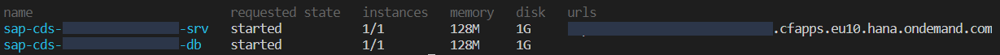

# sap-cds-business-service
Business Service using Node.js

* [Before start](#before-start)
* [Getting Started](#getting-started)
  * [Create a new project](#create-a-new-project)
  * [Start the cds server-side process](#start-the-cds-server-side-process)
  * [External Persistence Database](#external-persistence-database)
  * [Deploy the data model to a SQLite database](#deploy-the-data-model-to-a-sqlite-database)
  * [Open the database in SQLite](#open-the-database-in-sqlite)
- [Deploy in Cloud Foundry](#deploy-in-cloud-foundry)
  * [Create Service](#create-service)
  * [Build and Deploy](#build-and-deploy)
- [Useful commands](#useful-commands)
 
## Before start

- Download and install the cds plugin for `vscode` and install. download at [vscode-cds-plugin](https://tools.hana.ondemand.com/#cloud-vscodecds)

- Download the latest command line interface (CLI) from the Cloud Foundry at https://github.com/cloudfoundry/cli#downloads

- Set the `npm` registry for `@sap` packages by executing the statement below at the command line

```
npm set @sap:registry=https://npm.sap.com
```

- Install `cds-dk` the enable the proper cds support.

```
npm i -g @sap/cds-dk
```

Check if the installation was successful by executing `cds version`

- Make sure the `@sap/cds` is installed

```
npm install @sap/cds
```


## Getting Started


#### Create a new project 

Create a new project by typing the statement below at the command line in any directory. It will imply in a creation of a new cds project with their default elements.

```
cds init ${PROJECT_NAME}
```


#### Start the cds server-side process 

```
cds watch
```


#### External Persistence Database

Using an external database instead of using the existing in-memory.

- install sqlite3 packages `npm i sqlite3 -D` into your project workspace
- download and install the sqlite3 on https://www.sqlite.org/download.html

#### Deploy the data model to a SQLite database

```
cds deploy --to sqlite:db\com.bookstore.db
```

The newly database is now created under `db/com.bookstore.db`, you may want to open it on sqlite at the command line.


#### Open the database in SQLite

Statement below describes the newly database.

```
sqlite3 .\db\com.bookstore.db -cmd .dump
```

## Deploy in Cloud Foundry

- Login to Cloud Foundry environment by executing the statement below. Make sure you have configured the right CF api endpoint in the file. Enter your password when prompted.

``` windows
# windows
cf_login.bat

# unix
cf_login.sh
```
Once you are logged, you should see the your API endpoint, user, organisation, and space.

- Add the SAP HANA driver and client into your project

```javascript
npm add hana
npm install @sap/hana-client
```


#### Create Service

Create the SAP HANA Service manually 

```
cf create-service hanatrial hdi-shared ${APPLICATION_NAME}-hdi-container
```


#### Build and Deploy

Now that the service is create, you're now able to bind apps to the service

```
cds build
cf push -f gen/db

#--random-route (optional)
cf push -f gen/srv 
```

Once it get finished, use `cf apps` to check whether application is running and which route is assigned with.



## Useful commands

It contains these folders and files, following our recommended project layout:

File / Folder  | Purpose
---------------|----------
`app/`         | content for UI frontends go here
`db/`          | your domain models and data go here
`srv/`         | your service models and code go here
`package.json` | project metadata and configuration
`readme.md`    | this getting started guide


## Next Steps...

- Open a new terminal and run  `cds watch`
- ( in VSCode simply choose _**Terminal** > Run Task > cds watch_ )
- Start adding content, e.g. a [db/schema.cds](db/schema.cds), ...


### Learn more...

CAP Get Started https://cap.cloud.sap/docs/get-started/

Create a Business Service with Node.js https://developers.sap.com/tutorials/cp-apm-nodejs-create-service.html

Service CF Deploy https://developers.sap.com/tutorials/cap-service-deploy.html